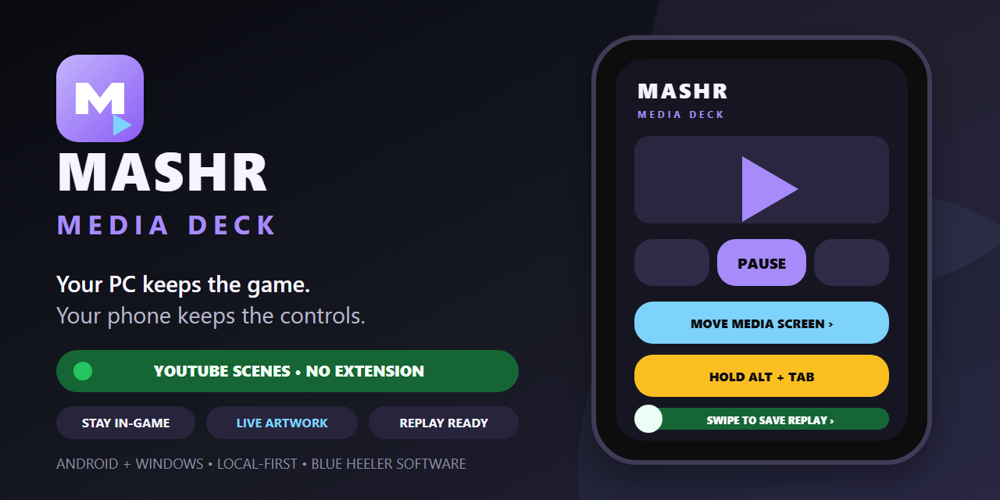
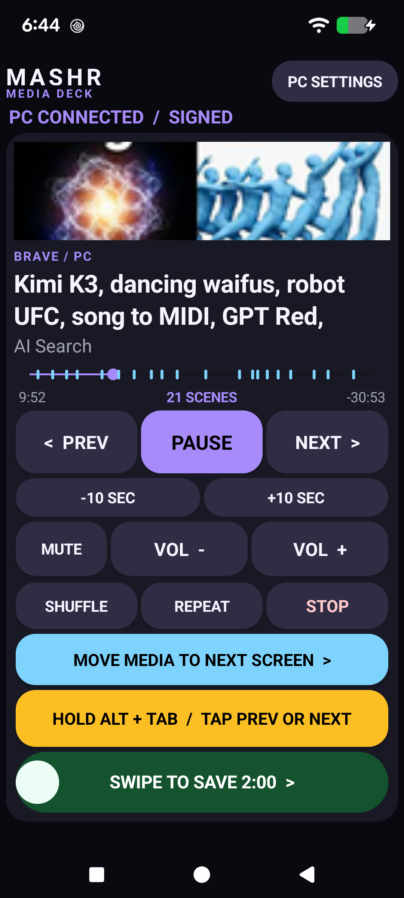
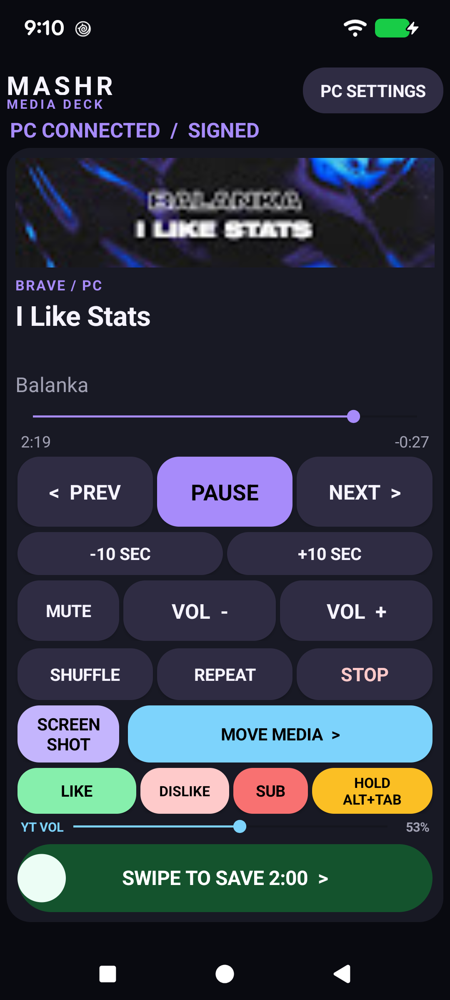
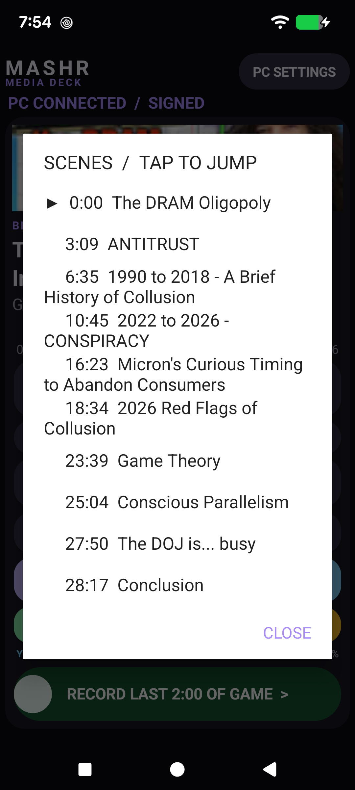
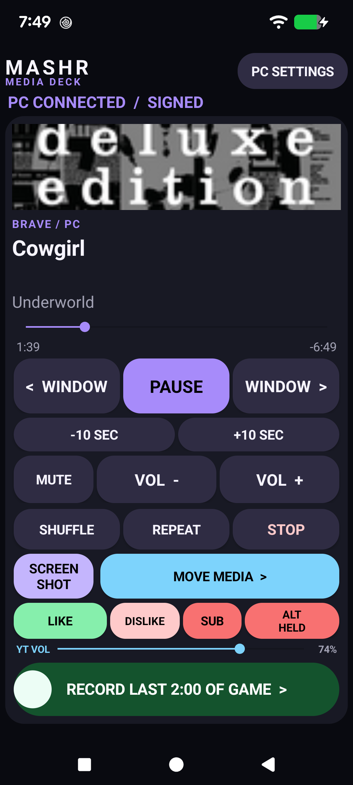
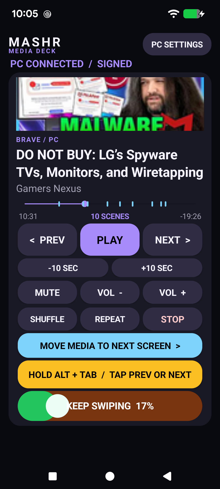
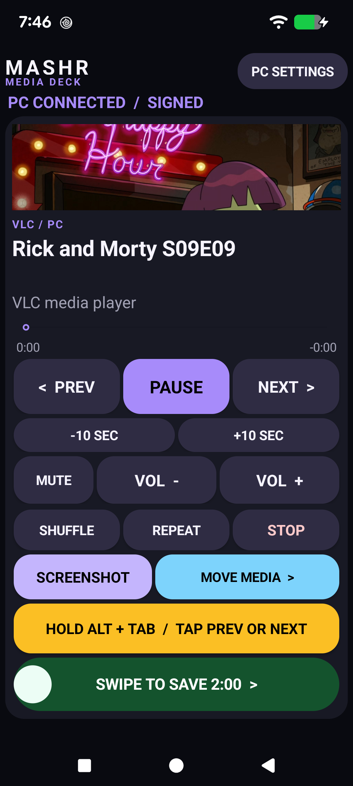
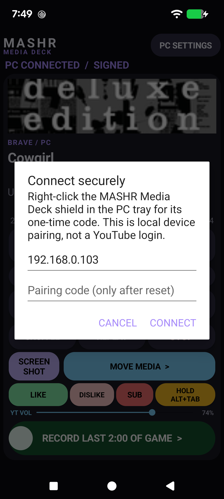

# MASHR Media Deck



> Your PC keeps the game. Your phone keeps the controls.

[](#quick-start)
[](#quick-start)
[](#security-model)
[](#security-model)
[](#no-extension-needed)

MASHR Media Deck is a second-screen Android remote built for PC gamers who do not want to Alt+Tab out of a game just to manage music or video. The Pixel shows the selected Windows media session, artwork, live timeline, chapter markers, and large controls while the game keeps focus.



## No extension needed

**Everything in the core deck works with the Android app and Windows companion alone.** That includes YouTube artwork and metadata, live progress, chapter markers, the tappable **SCENES** list, Like/Dislike/Subscribe, actual YouTube player volume, transport and system-volume controls, monitor switching, held Alt+Tab, NVIDIA replay, local pairing, and automatic reconnect.

The browser helper is not required for any control shown above. It exists for one separate, optional extra: the 3×3 related-video grid. Ignore or delete `browser-extension` and the main experience is unchanged.

## What it does

- Large play/pause, previous/next, volume, mute, shuffle, repeat, stop, and ±10-second controls.
- Live artwork, title, artist, elapsed time, remaining time, and continuously updating progress.
- Tappable YouTube creator chapters as progress markers and a **SCENES** list—no extension required.
- Extension-free YouTube **LIKE**, **DISLIKE**, and **SUB** controls through the selected browser window's Windows accessibility surface.
- A compact **YT VOL** slider that reads and changes the selected YouTube player's own 0–100 volume without changing Windows master volume.
- Guarded NVIDIA Instant Replay slider that shows whether the buffer is off, arms it explicitly, and saves with NVIDIA's configured hotkey.
- Hold-to-use Alt+Tab: keep the yellow control held and use **PREV/NEXT** as window-switcher arrows.
- Move the selected media window to the next monitor without stealing focus.
- Save a PC screenshot using NVIDIA Overlay's configured shortcut, with a Windows fallback.
- Automatic reconnect through a background Windows tray companion.
- Optional 3×3 related-video grid from a narrowly scoped helper—the only feature that uses it.

See the [screenshot gallery](docs/SCREENSHOTS.md) and [press kit](docs/PRESS-KIT.md).

## See it in action

Every screen below is a real Pixel 7 capture from the extension-free core.

<table>
  <tr>
    <td colspan="2" valign="top">
      <br>
      <strong>React without surfacing the browser.</strong><br>
      The larger Like, smaller Dislike, Subscribe, compact multitouch Alt+Tab, and tiny actual-player volume slider work through the authenticated companion without an extension.
    </td>
  </tr>
  <tr>
    <td width="50%" valign="top">
      <br>
      <strong>YouTube, already understood.</strong><br>
      Artwork, title, creator, live time, and creator chapters appear without a browser add-on.
    </td>
    <td width="50%" valign="top">
      <br>
      <strong>Tap straight to the good bit.</strong><br>
      The chapter list highlights the current scene and jumps to any creator timestamp.
    </td>
  </tr>
  <tr>
    <td width="50%" valign="top">
      <br>
      <strong>Alt+Tab without leaving the phone.</strong><br>
      Hold the red state and use the renamed window arrows with a second finger.
    </td>
    <td width="50%" valign="top">
      <br>
      <strong>Hard to trigger by accident.</strong><br>
      Replay requires a deliberate left-to-right swipe and reports progress before it acts.
    </td>
  </tr>
  <tr>
    <td width="50%" valign="top">
      <br>
      <strong>Capture without leaving the game.</strong><br>
      The dedicated button uses NVIDIA's configured Screenshot shortcut, with a Windows fallback—and the same deck works with VLC.
    </td>
    <td width="50%" valign="top">
      <br>
      <strong>Pair locally, not with a media account.</strong><br>
      The one-time code belongs to the PC companion—there is no YouTube or cloud login.
    </td>
  </tr>
</table>

## Designed for the couch-and-keyboard problem

MASHR Media Deck is not a general remote-desktop app. It exposes a small allowlisted media-control surface so a phone can handle the routine interruptions while the PC remains on the game:

| Moment | Phone action |
| --- | --- |
| A track is too loud | Tap **VOL −** or **MUTE** |
| A video drifts into filler | Tap **+10 SEC** or a chapter marker |
| A video earns a reaction | Tap **LIKE**, **DISLIKE**, or **SUB** |
| YouTube itself is too loud | Drag the tiny **YT VOL** slider |
| The media window is on the wrong display | Tap **MOVE MEDIA TO NEXT SCREEN** |
| Something worth clipping just happened | Swipe the guarded replay control |
| A different PC window is needed | Hold **ALT + TAB**, then tap **PREV/NEXT** |

## Security model

The phone needs no Google login, YouTube account access, Android media permission, or cloud account. It pairs once with the PC companion using a six-digit tray code.

- Every media/control request is authenticated with HMAC-SHA256.
- Requests have a 30-second clock window and one-use nonce.
- Successful pairing closes the code; resetting pairing rotates the 256-bit key.
- Recommended LAN mode binds to one PC interface and accepts only the paired phone IP.
- Control commands are fixed and allowlisted—there is no shell, arbitrary URL, file upload, process ID, window handle, or coordinate endpoint.
- YouTube actions target only named accessibility controls in the selected YouTube browser window; the phone cannot send arbitrary clicks or keys.
- YouTube volume accepts only a 0–100 level; the companion derives the exact verified Volume slider and browser render host instead of accepting caller-provided coordinates or key codes.
- Browser-helper traffic is loopback-only.
- YouTube chapters use the public page for the exact selected watch URL and send no browser cookies.

Do not forward TCP `43821` or UDP `43822` on a router. Read [SECURITY.md](SECURITY.md) for the complete threat model and remaining HTTP confidentiality limitation.

## Quick start

### 1. Build

Requirements:

- Windows 10 or 11
- .NET 10 SDK
- JDK 17
- Android SDK 36 / Build Tools 36
- Android device with USB debugging for direct deployment

```powershell
dotnet build companion/MediaDeck.Companion.csproj -c Debug
./gradlew.bat :app:assembleDebug
```

The Android APK is written to:

```text
app/build/outputs/apk/debug/app-debug.apk
```

### 2. Restrict LAN access

LAN access is off by default. From an Administrator Command Prompt, enable the recommended paired-phone mode with the Pixel and PC addresses:

```bat
companion\Configure-LanAccess.cmd PairedPhone PHONE_IP PC_IP
```

This keeps the existing Windows private/public network profile unchanged, disables stale broad rules, binds the companion to the chosen PC interface, and scopes the firewall to the given phone IP. `SameSubnet` is available as a convenience fallback, but every device on that subnet can then reach the authenticated HTTP listener.

### 3. Pair the phone

1. Start `companion/bin/Debug/net10.0-windows10.0.19041.0/MediaDeck.Companion.exe`.
2. Right-click or double-click the **MASHR Media Deck** shield in the notification area.
3. On the phone, tap **PC SETTINGS**, enter the six-digit code, and tap **PAIR**.
4. Leave the PC address blank to use local discovery, or enter it directly.

The stable executable, Android package, scheduled-task name, discovery token, HMAC headers, and pairing-storage path retain their original `MediaDeck` identifiers so existing installs upgrade without losing pairing or restart behavior.

## YouTube scenes and actions

**No extension is used for this.**

For Brave, Chrome, and Edge, the companion reads the address bar of the unambiguous selected media window through Windows UI Automation. When it is an exact YouTube watch URL, creator-published description timestamps become progress markers. Tap **SCENES** between elapsed and remaining time to jump to a chapter. The same extension-free accessibility surface activates only the visible, named Like, Dislike, Subscribe, or Volume control; Subscribe never doubles as an unsubscribe action. **YT VOL** changes the webpage player's own value while leaving Windows master volume and the physical cursor alone.

## Optional extra: related-video grid

The 3×3 related-video grid is the one feature that cannot be recovered from Windows media sessions or the public watch page. It is separate from playback, thumbnails, progress, controls, and scenes.

<details>
<summary>Install the narrowly scoped helper for this extra only</summary>

To enable only the related-video grid:

1. Open `brave://extensions` or `chrome://extensions`.
2. Enable **Developer mode**.
3. Choose **Load unpacked** and select `browser-extension`.
4. Reload the YouTube watch page.

The helper requests access only to YouTube watch pages and `127.0.0.1:43821`; it requests no history, cookies, or general browsing access.

</details>

## NVIDIA Instant Replay

MASHR Media Deck reads NVIDIA Overlay's local `ShareSettings.json` for:

- whether Instant Replay is enabled;
- the configured rolling-buffer duration;
- the configured `DVRSave` and `DVRToggle` shortcuts.

When replay is off, the slider is orange and says **SWIPE TO ARM REPLAY**. Once NVIDIA reports the buffer enabled, it turns green and becomes **SWIPE TO SAVE**. The remote does not expose a disarm action, so stale phone state cannot accidentally switch the buffer off.

## Restart reliability

Register the companion as an **At log on** task so it reconnects without a visible terminal:

```powershell
$exe = (Resolve-Path './companion/bin/Debug/net10.0-windows10.0.19041.0/MediaDeck.Companion.exe').Path
$action = New-ScheduledTaskAction -Execute $exe -WorkingDirectory (Split-Path $exe)
$trigger = New-ScheduledTaskTrigger -AtLogOn -User $env:USERNAME
$settings = New-ScheduledTaskSettingsSet -ExecutionTimeLimit ([TimeSpan]::Zero) -RestartCount 3 -RestartInterval (New-TimeSpan -Minutes 1)
Register-ScheduledTask -TaskName 'MediaDeck Companion' -Action $action -Trigger $trigger -Settings $settings -Description 'Authenticated MASHR Media Deck LAN companion' -Force
Start-ScheduledTask -TaskName 'MediaDeck Companion'
```

## Supported players

- YouTube and YouTube Music in Brave, Chrome, or Edge
- Spotify
- VLC focused-window fallback
- Most players that publish a Windows global media session

## Project status

MASHR Media Deck `1.4.0` is an owner-tested developer preview for a Pixel 7 and Windows 11 gaming PC. It has no analytics, cloud backend, advertising, or account system.

Release history is in [CHANGELOG.md](CHANGELOG.md).
