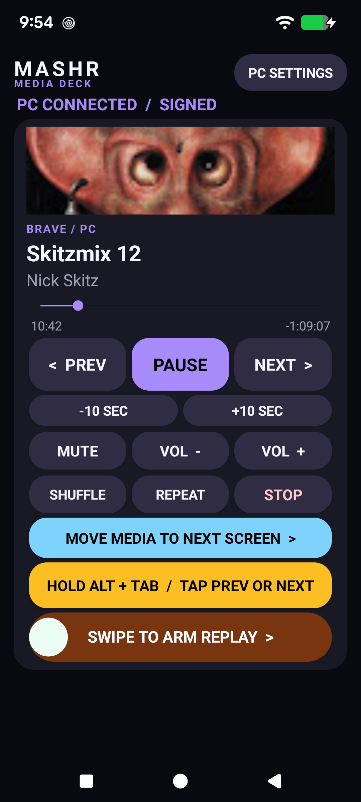
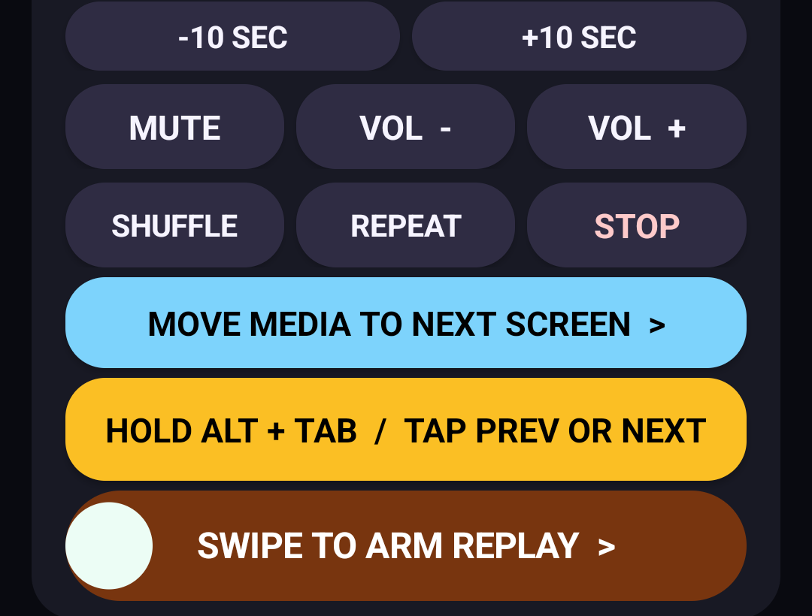

# MASHR Media Deck press kit

## Identity

**Product:** MASHR Media Deck  
**Category:** Local second-screen media remote for PC gamers  
**Current release:** 1.4.0 developer preview  
**Platforms:** Android 8+ phone; Windows 10/11 PC companion  
**Developer:** Blue Heeler Software

## Tagline

> Your PC keeps the game. Your phone keeps the controls.

## Hero claim

> YouTube scenes. Live artwork. Full media controls. Zero browser extensions required.

## One-line description

MASHR Media Deck turns an Android phone into a secure, extension-free local media deck for PC gamers who do not want to Alt+Tab.

## Short description

Control PC music and video from a bold, glanceable Android deck while the game keeps focus. MASHR Media Deck shows artwork and a live timeline, exposes large media controls, jumps through YouTube chapters, moves the media window between monitors, drives Alt+Tab deliberately, and guards NVIDIA Instant Replay behind a swipe.

## Long description

MASHR Media Deck solves the small but constant interruption of leaving a PC game to manage background media. A lightweight Windows tray companion reads the selected Windows media session and a paired Android phone presents the useful parts as large, unmistakable controls.

The system is local-first: no cloud backend, account, Google login, analytics, or remote-desktop surface. Authenticated commands are allowlisted, replay-resistant, and firewall-scopeable to one paired phone.

The core deck needs no browser extension. YouTube artwork, metadata, live progress, creator chapter markers, the tappable scene list, media controls, monitor switching, held Alt+Tab, replay, pairing, and reconnect all work with only the Android app and Windows companion. A narrowly scoped helper exists for one optional extra—the related-video grid—and nothing else depends on it.

## Feature callouts

- Stay in-game while controlling PC music and video.
- Glanceable artwork, metadata, and live progress.
- Creator chapter markers and a tappable scene list.
- No browser extension for the complete core deck.
- Guarded arm/save flow for NVIDIA Instant Replay.
- Hold-to-use Alt+Tab window switching.
- Focus-preserving media-window monitor cycling.
- One-tap PC screenshots through the configured NVIDIA shortcut or Windows fallback.
- One-phone LAN restriction and signed requests.
- No cloud account, analytics, advertising, or media login.

## Screenshot captions

### Extension-free YouTube deck

**Caption:** MASHR finds artwork, live time, and creator chapters from the selected YouTube session without a browser extension.

### Scene picker

**Caption:** The current scene is highlighted; every creator timestamp is one tap away.

### Held Alt+Tab

**Caption:** Hold Alt on the phone while a second touch steps left or right through the Windows switcher.

### Replay gesture

**Caption:** The high-consequence replay action exposes its activation progress instead of firing on a stray tap.

### Local pairing

**Caption:** The phone pairs directly with the PC companion—no YouTube, Google, or cloud account.

### Screenshot button

**Caption:** Capture the PC through NVIDIA's configured shortcut without leaving the game; Windows provides the fallback.

### Main deck

**Caption:** A second Windows media session shows that the deck is not limited to YouTube.

**Alt text:** Dark Android media remote showing artwork, live progress, large purple transport buttons, blue monitor control, yellow Alt+Tab control, and orange NVIDIA replay slider.

### Replay control detail

**Caption:** Replay state is explicit: orange arms the rolling buffer; green saves the configured history.

**Alt text:** Lower part of MASHR Media Deck with monitor switching, Alt+Tab, and swipe-to-arm replay controls.

## Brand palette

| Name | Hex | Use |
| --- | --- | --- |
| Night | `#090A10` | Primary background |
| Card | `#181924` | Panels |
| MASHR purple | `#A78BFA` | Identity, progress, active controls |
| Deck blue | `#7DD3FC` | Monitor action and chapter markers |
| Replay green | `#22C55E` | Armed replay |
| Replay amber | `#F59E0B` | Replay requires arming |
| Ink | `#F6F4FF` | Primary text |

Logo assets:

- [Vector mark](images/mashr-mark.svg)
- [Social preview](images/mashr-media-deck-social.png)

## Ready-to-use launch copy

### Short post

MASHR Media Deck turns your Android phone into an extension-free local PC media remote built for gaming: big controls, YouTube scenes, monitor switching, deliberate Alt+Tab, and guarded NVIDIA Instant Replay—without leaving the game or adding a cloud account.

### Longer post

Meet MASHR Media Deck from Blue Heeler Software: a second-screen Android remote for PC gamers who are tired of Alt+Tabbing just to pause a video, change a track, or save a replay. It pairs directly with a Windows tray companion, keeps controls local and authenticated, shows live artwork and progress, adds YouTube chapter scenes without an extension, moves the media window between monitors, and makes NVIDIA replay state obvious before you swipe. The optional browser helper adds only a related-video grid; the deck itself does not need it.

### Repository description

Extension-free local Android media deck for PC gamers—live artwork, YouTube scenes, monitor switching, Alt+Tab, and NVIDIA replay.

## Claims guidance

Use:

- “local-first”
- “authenticated and paired”
- “no cloud backend”
- “tested on Pixel 7 and Windows 11”
- “developer preview”

Avoid:

- claiming formal security certification;
- claiming support for every Windows media player;
- describing the optional browser helper as required for chapters;
- implying that playback, artwork, progress, scenes, or controls require a browser extension;
- presenting the debug APK as a store-signed production build.
