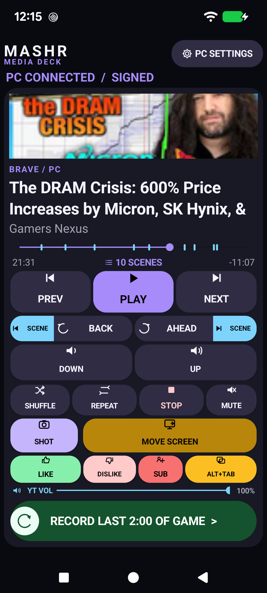
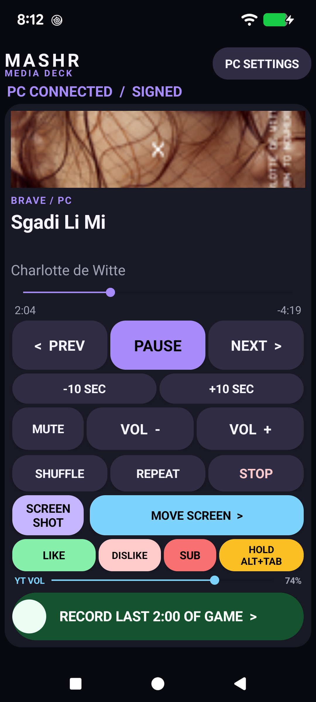
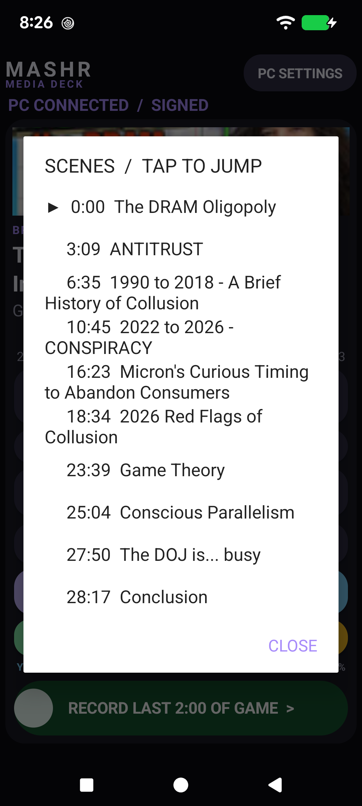
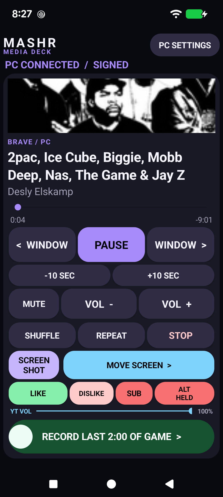
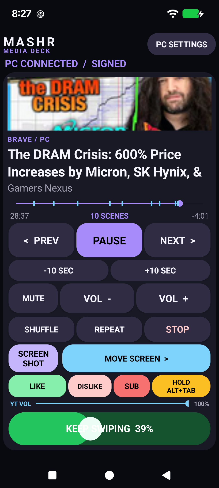
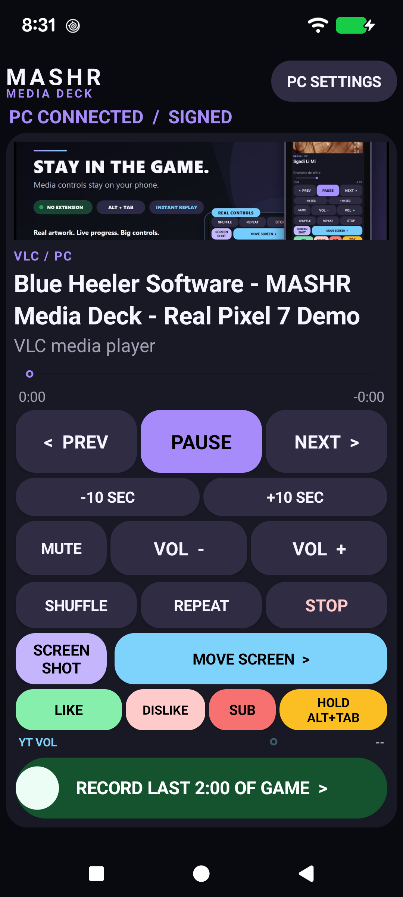
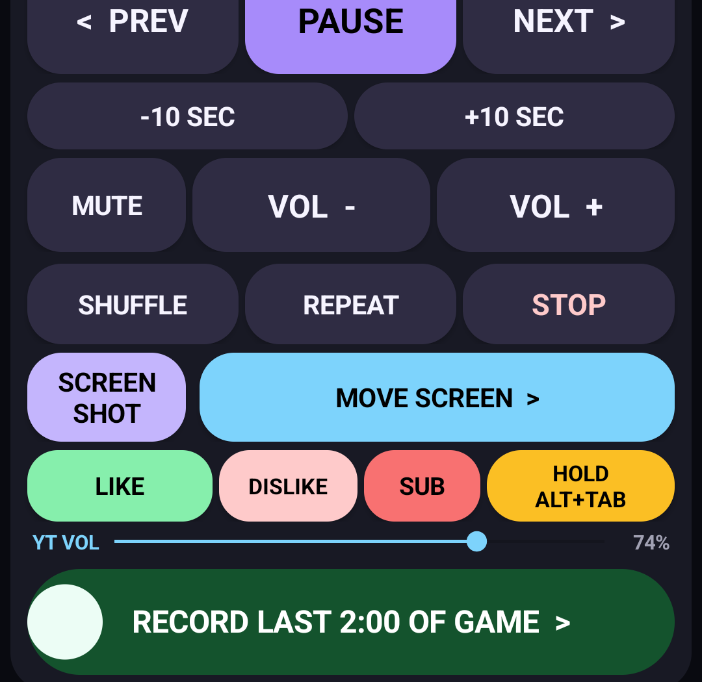
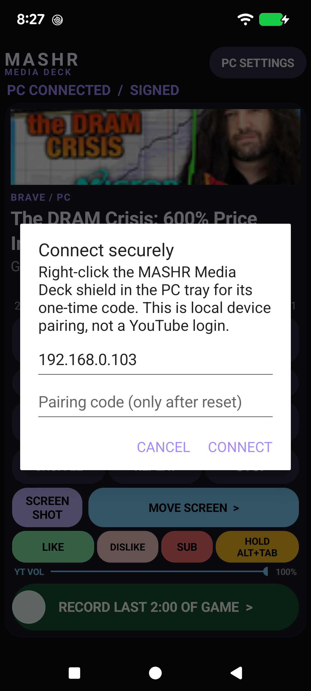
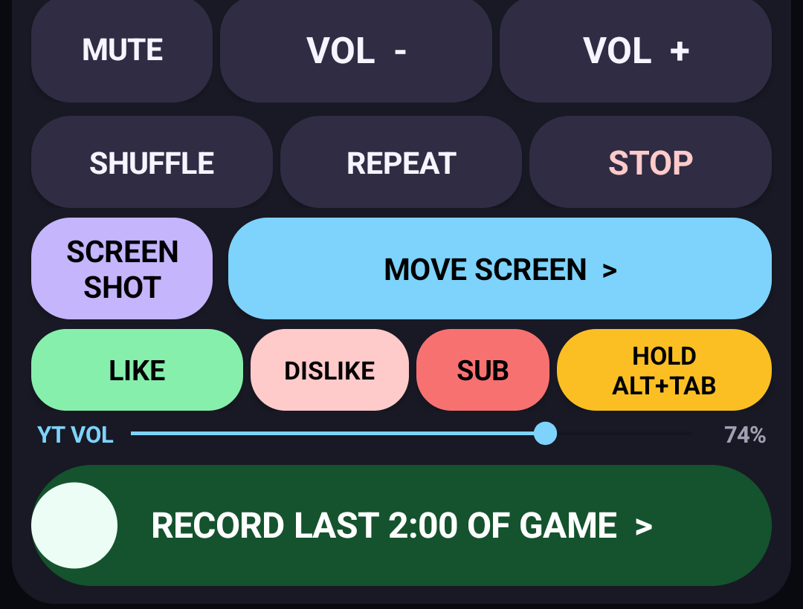
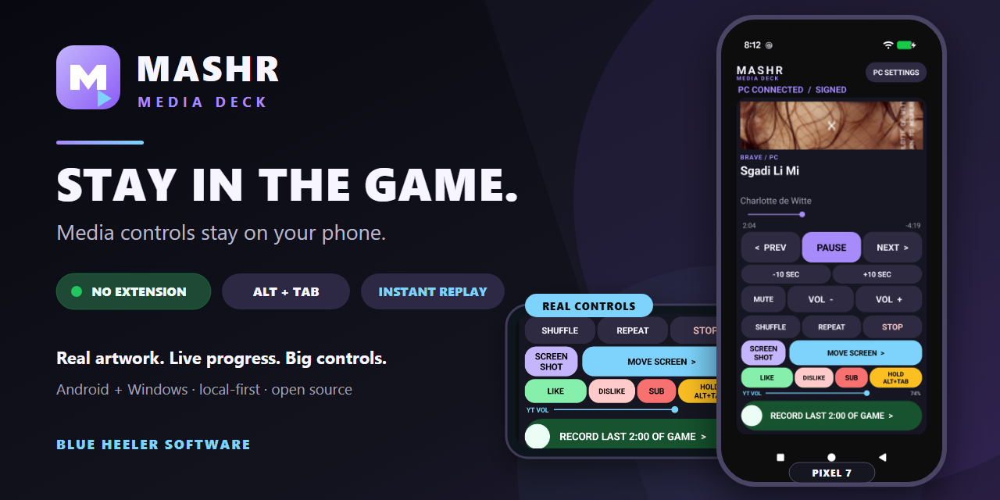

# MASHR Media Deck screenshots

Every image in this gallery is a real Pixel 7 capture rather than a drawn UI mock-up. The lead control-deck image is freshly captured from 1.9.11; the focused interaction examples remain cache-busted 1.4.8 captures. YouTube artwork, live progress, chapter markers, reactions, subscription, the scene picker, playback controls, monitor switching, Alt+Tab, replay, and local pairing all work without a browser extension.

## Extension-free YouTube deck

The companion identifies the selected YouTube watch page and turns creator timestamps into cyan progress markers. Blue **SCENE** edges jump to the previous or next annotation while the dark **BACK/AHEAD** bodies use the configurable default skip. The golden-brown **MOVE SCREEN** control remains visually separate from scene navigation. No browser extension, YouTube login, or cloud service is involved.

## YouTube actions and compact Alt+Tab

The selected YouTube page exposes its named controls through Windows accessibility. MASHR makes **LIKE** larger than **DISLIKE**, keeps **SUB** and held multitouch Alt+Tab compact, and adds a tiny **YT VOL** slider for the webpage player's actual volume—not Windows master volume.

## Tappable scene list

The current chapter is marked with a play arrow. Every row is a direct seek target.

## Held Alt+Tab mode

While the red control is held, **PREV/NEXT** become left/right window-switcher arrows and still accept a second touch.

## Guarded replay gesture

The slider shows progress before crossing its activation threshold, making an accidental replay action much less likely. Once armed, the destination is explicit: **RECORD LAST 2:00 OF GAME**.

## Another Windows media session

This capture uses a locally generated MASHR demo clip in VLC. The same portrait deck handles compatible Windows media sessions with artwork, metadata, and large controls.

## Dedicated screenshot action

The lavender **SCREENSHOT** button invokes NVIDIA Overlay's configured Screenshot shortcut when available. A fixed Windows saved-screenshot shortcut is the fallback; the phone cannot supply arbitrary keys.

## Local pairing, not a media login

Pairing is between the phone and PC companion. The app does not ask for a YouTube, Google, or cloud account.

## Gamer-control detail

Golden-brown **MOVE SCREEN** moves the media window between displays, yellow controls Alt+Tab, and green **RECORD LAST 2:00 OF GAME** makes the armed Instant Replay result unmistakable.

## Social card

